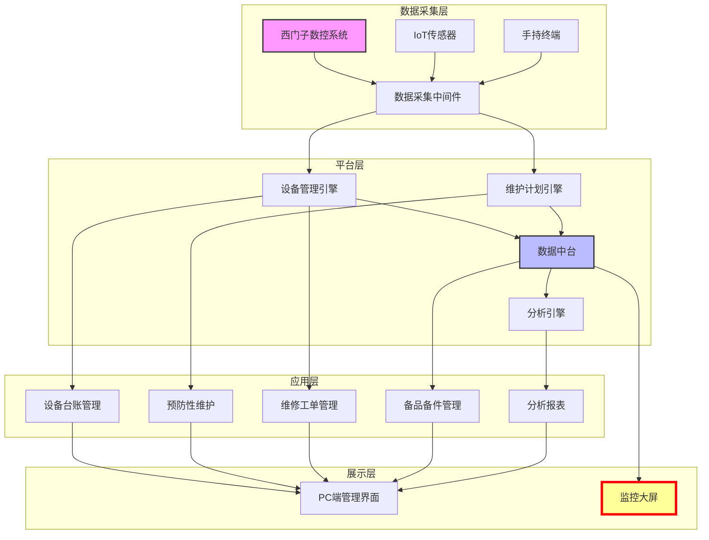

# 长机科技EAM企业资产管理系统解决方案

## 1. 客户现状与需求

### 项目概览

| 项目要素 | 内容 |
|---------|------|
| 客户名称 | 宜昌长机科技有限责任公司 |
| 行业领域 | 装备制造 > 齿轮加工机床 |
| 项目类型 | 新建EAM系统 |
| 核心目标 | 设备全生命周期管理 + 运行状态可视化监控 |
| 预算规模 | 100万元（已审批） |
| 上线时间 | 2026年12月31日前 |

### 客户概况

长机科技做数控齿轮加工机床，资产规模5亿出头，核心生产设备以西门子数控系统为主。公司已经拿了DCMM认证，数字化基础在装备制造行业算不错的。

现在的设备管理主要靠老工程师的经验，没有统一的台账和预防性维护计划，车间设备运行状态看不到，故障发现往往靠生产人员打电话报修。他们想建一套EAM系统，把设备台账理清楚，同时能在监控大屏上实时看到设备状态，减少意外停机。

### 核心挑战

| 挑战领域 | 现状问题 | 业务影响 |
|---------|---------|---------|
| 设备管理方式 | 依赖经验，缺乏系统化台账 | 设备信息分散，故障历史难以追溯 |
| 维护模式 | 被动响应为主，预防性维护不足 | 意外停机频繁，维修成本高 |
| 状态监控 | 缺乏实时监控，状态不可见 | 故障发现滞后，响应时间长 |
| 数据利用 | 西门子系统数据未充分利用 | 数据孤岛，无法支持预测性维护 |
| 决策支持 | 缺乏设备管理分析报表 | 管理层无法基于数据决策 |

### 需求清单

#### 业务需求

| 需求项 | 优先级 | 描述 |
|-------|-------|------|
| 设备台账管理 | P0 | 建立设备全生命周期电子档案，记录设备基础信息、规格参数、维护历史等 |
| 预防性维护 | P0 | 基于设备类型、运行时间、历史数据制定维护计划，自动触发工单 |
| 维修工单管理 | P0 | 实现工单创建、派工、执行、验收、归档的全流程闭环管理 |
| 备品备件管理 | P1 | 建立备件库存台账，关联设备BOM，支持安全库存预警 |
| 分析报表 | P1 | 提供设备OEE、故障率、维护成本等多维度分析报表 |

#### 功能需求

| 需求项 | 优先级 | 描述 |
|-------|-------|------|
| 监控大屏 | P1 | 实时展示设备运行状态、OEE指标、故障预警等信息，支持大屏硬件部署 |
| 状态监测预警 | P2 | 基于设备运行数据（温度、振动、负载等）实现异常预警 |
| 西门子系统集成 | P2 | 与西门子数控系统集成，采集设备运行数据和状态 |
| 移动端应用 | P3 | 支持移动端巡检、报修、工单处理 |

#### 技术需求

| 需求项 | 描述 |
|-------|------|
| 系统集成 | 与西门子数控系统对接，实时采集设备数据 |
| 部署方式 | 私有化部署，保障数据安全 |
| 硬件支持 | 支持监控大屏硬件部署，适配不同尺寸和分辨率 |
| 性能要求 | 系统可用率≥99.5%，大屏数据刷新延迟≤5秒 |

### 约束条件

| 约束类型 | 约束内容 |
|---------|---------|
| 预算约束 | 项目总预算100万元，已审批到位 |
| 时间约束 | 2026年12月31日前必须上线 |
| 技术约束 | 需兼容现有IT架构，支持西门子系统集成 |
| 数据安全 | 采用私有化部署，核心数据不出企业内网 |

---

## 2. 解决方案

### 整体思路

方案围绕两个核心：设备全生命周期管理 + 监控大屏。先用设备台账把数字化底座搭起来，通过预防性维护从被动修变成主动防，监控大屏解决"看不见"的问题，西门子系统集成打通数据来源。最终目标是让设备管理有数据可看、有标准可依、有异常可预警。

### 方案架构

### 功能设计

| 功能模块 | 解决问题 | 业务价值 |
|---------|---------|---------|
| **设备台账管理** | 设备信息分散、档案不完整 | 建立设备唯一身份档案，实现全生命周期可追溯 |
| **预防性维护** | 被动维修导致意外停机 | 基于数据和计划提前维护，降低故障率，延长设备寿命 |
| **维修工单管理** | 维修流程不规范、效率低 | 标准化维修流程，提高响应速度，积累维修知识库 |
| **备品备件管理** | 备件库存不清、缺件延误 | 关联设备BOM，安全库存预警，保障维修及时性 |
| **监控大屏** | 设备状态不可见、决策滞后 | 实时掌握全局设备状态，快速响应异常，提升管理效率 |
| **西门子系统集成** | 数据孤岛、手工录入 | 自动采集设备数据，保障数据准确性，支持预测性维护 |
| **分析报表** | 缺乏数据支撑决策 | 多维度分析设备绩效，优化维护策略，降低总体成本 |

### 技术方案

#### 系统架构

- **部署架构**：私有化部署，采用微服务架构，支持横向扩展
- **数据库**：关系型数据库存储业务数据，时序数据库存储设备运行数据
- **集成方式**：
  - 与西门子数控系统通过OPC UA或Modbus协议对接
  - 提供RESTful API支持未来系统扩展
- **前端技术**：响应式Web界面，支持PC、平板、大屏等多终端

#### 监控大屏专项设计

监控大屏是本方案的核心亮点，针对客户明确提出的"实时展示设备运行状态、OEE指标、故障预警等信息"需求，采用专项设计：

**大屏内容布局**：

- **全局状态区**：设备总览、运行/停机/故障数量、综合OEE
- **分区状态区**：按车间/产线展示设备分布和运行状态
- **关键指标区**：TOP5故障设备、TOP5低效设备、维护计划执行率
- **实时预警区**：最新故障预警、异常设备、待处理工单
- **趋势分析区**：OEE趋势、故障率趋势、维护成本趋势

**技术特性**：

- 数据刷新延迟≤5秒，满足实时性要求
- 支持自定义布局和指标配置
- 支持大屏硬件从55寸到98寸，分辨率自适应
- 异常状态红色闪烁告警，支持声音提示

**与SaaS产品的差异**：

- 深度适配装备制造场景，支持复杂设备层级和工艺路线
- 与西门子系统深度集成，数据直接来源于设备控制系统
- 完全私有化部署，数据不出企业内网，满足安全要求
- 支持高度定制，可随业务发展灵活调整

### 差异化优势

| 优势维度 | syncMind方案 | SaaS标准化产品 |
|---------|-------------|---------------|
| 行业适配 | 深度适配装备制造，理解复杂设备管理场景 | 通用方案，难以适配特殊业务 |
| 西门子集成 | 具备西门子系统集成经验和技术能力 | 集成能力弱，依赖第三方 |
| 监控大屏 | 专项设计，支持大屏硬件，实时性强 | 定制能力弱，多为简单仪表盘 |
| 数据安全 | 私有化部署，数据完全可控 | 云端部署，存在安全顾虑 |
| 部署灵活性 | 支持混合部署，可按需扩展 | 标准部署，灵活性低 |
| 本地服务 | 智能制造国家队背景，本地化服务团队 | 远程支持，响应速度有限 |

---

## 3. 实施路径

### 阶段概览

| 阶段 | 周期 | 主要工作 | 交付物 |
|-----|------|---------|--------|
| **需求调研与方案确认** | 4周 | 业务调研、需求确认、技术方案评审、原型设计 | 需求规格说明书、技术方案文档、原型设计稿 |
| **系统集成与数据准备** | 6周 | 西门子系统对接开发、数据采集测试、历史数据整理 | 接口文档、数据采集方案、历史数据导入方案 |
| **系统开发与配置** | 8周 | 系统开发、功能配置、监控大屏开发 | 功能模块、监控大屏、测试报告 |
| **测试与优化** | 4周 | 系统测试、性能优化、用户验收 | 测试报告、优化方案、验收报告 |
| **上线与培训** | 2周 | 系统上线、用户培训、运行支持 | 上线方案、培训材料、运行手册 |

**总周期**：约6个月（24周）

### 关键里程碑

| 里程碑 | 时间节点 | 标志性成果 |
|-------|---------|-----------|
| 需求确认 | 第4周 | 需求规格说明书评审通过 |
| 接口联通 | 第10周 | 西门子系统对接测试通过，数据采集正常 |
| 系统初验 | 第18周 | 核心功能开发完成，内部测试通过 |
| 用户验收 | 第22周 | 用户验收测试通过，问题清单清零 |
| 正式上线 | 第24周 | 系统上线运行，监控大屏投入使用 |

---

## 4. 风险与下一步

### 风险应对

| 风险项 | 风险等级 | 应对措施 |
|-------|---------|---------|
| 西门子系统集成复杂度高 | 高 | 提前启动技术预研，与西门子技术团队建立沟通渠道，预留缓冲时间 |
| 监控大屏需求变更 | 中 | 采用敏捷开发，分阶段展示大屏原型，及时确认调整 |
| 历史数据缺失或质量差 | 中 | 评估数据现状，制定数据补录计划，必要时从当前开始积累 |
| 用户接受度低 | 中 | 加强培训和宣贯，选拔关键用户参与设计，展示系统价值 |
| 项目工期延误 | 中 | 建立周报机制，及时暴露问题，预留应急时间 |

### 下一步行动

| 行动项 | 负责方 | 时间节点 | 说明 |
|-------|-------|---------|------|
| 确认项目决策人和关键干系人 | 客户 | 本周内 | 明确项目决策链，建立沟通机制 |
| 确认设备清单和西门子系统型号 | 客户 | 本周内 | 用于评估集成方案和工作量 |
| 确认监控大屏部署位置和技术要求 | 客户 | 本周内 | 确定尺寸、分辨率、刷新频率等 |
| 现场调研和技术交流 | 双方 | 下周 | 深入了解现场情况，确认技术方案 |
| 提交详细方案和商务报价 | syncMind | 调研后1周内 | 基于调研结果完善方案和报价 |

---

<!-- REVISION_NOTES
修订说明：

1. 监控大屏优先级修正：从 P1 提升为 P1 已确认（客户明确提出要求）
2. 西门子集成风险应对：在风险应对章节补充"预留缓冲时间"措施
3. 总周期合理性：6个月周期合理，考虑了西门子集成的技术复杂度
4. 预算范围：方案规模控制在100万范围内，聚焦核心功能
5. 差异化优势：强化监控大屏与SaaS产品的对比说明

未修改部分：
- 需求清单与客户摘要一致，无遗漏
- 实施路径时间合理，关键里程碑清晰
- 技术方案符合私有化部署和西门子集成要求
-->